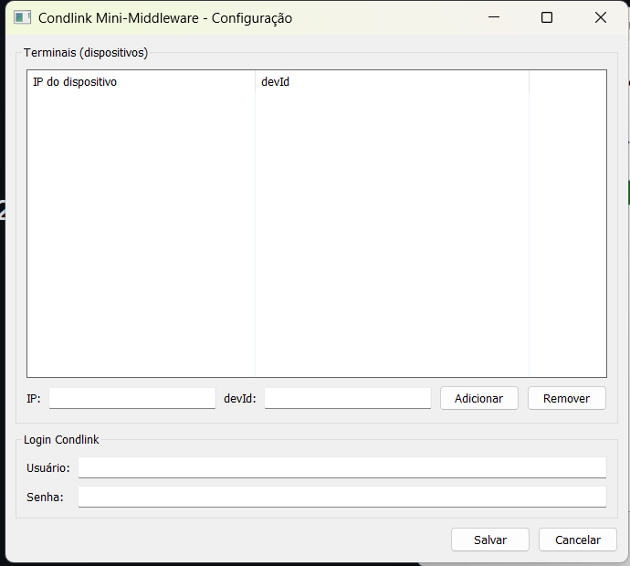

# mini-middleware

Serviço do Windows que expõe dispositivos locais (câmeras / controles de acesso)
para a plataforma Condlink através de túneis [Cloudflare](https://www.cloudflare.com/).

Roda na máquina que tem acesso à rede local dos dispositivos (tipicamente o PC da
portaria) e mantém, para cada dispositivo, um túnel HTTPS público que é registrado
automaticamente no Condlink — sem abrir portas no roteador nem configurar IP fixo.

> **Código-fonte:** [Condlinkdev/dev-backend → setup-tunel](https://github.com/Condlinkdev/dev-backend/tree/main/setup-tunel)

---

## Índice

- [Pré-requisitos](#pré-requisitos)
- [Instalação rápida](#instalação-rápida)
- [Como funciona (visão técnica)](#como-funciona-visão-técnica)
- [Configuração](#configuração)
- [Operação e diagnóstico](#operação-e-diagnóstico)
- [Solução de problemas](#solução-de-problemas)
- [Desinstalação](#desinstalação)
- [Compilação (desenvolvedores)](#compilação-desenvolvedores)

---

## Pré-requisitos

- **Windows** 7 SP1 ou superior (64 bits).
- Conta de **administrador** na máquina (o instalador registra um serviço).
- A máquina precisa estar na **mesma rede local** dos dispositivos e ter acesso à
  **internet** (para os túneis Cloudflare e a API do Condlink).
- Cada terminal já **cadastrado no Condlink**, com o respectivo `devId` (veja abaixo).

> O `cloudflared` já vem **embutido no instalador** — não é necessário baixar nada.

---

## Instalação rápida

### 1. Cadastrar os terminais no Condlink

1. Acesse [admin-condlink.vercel.app](https://admin-condlink.vercel.app).
2. Vá em **Instalação → Terminais → Gerenciar Terminais → Cadastrar Terminais**.
3. Selecione o Fabricante e Modelo, preencha os dados obrigatórios (Nome, **devId**,
   usuário, senha, status e Rota de Acesso) e salve.
4. Anote o **IP** de cada dispositivo e o **devId** cadastrado — você vai usá-los na
   tela de configuração.

### 2. Rodar o instalador

1. Copie `CondlinkMiniMiddlewareSetup_v1.0.0.exe` para a máquina da portaria.
2. Execute-o (**clique direito → Executar como administrador**) e aceite o UAC.
3. O instalador, sozinho, instala o serviço, abre a **tela de configuração** e, ao
   final, inicia o serviço.

### 3. Preencher a tela de configuração



- **Terminais:** digite o **IP** do dispositivo e o **devId**, clique em **Adicionar**
  (repita para cada dispositivo). Para tirar um da lista, selecione-o e clique em
  **Remover**.
- **Login Condlink:** informe o **Usuário** e a **Senha**.
- Clique em **Salvar**.

Pronto. O serviço inicia e os túneis sobem automaticamente — e voltam a subir sozinhos
sempre que o Windows for reiniciado. **Não** é preciso configurar o Agendador de Tarefas
nem criar arquivos manualmente.

---

## Como funciona (visão técnica)

1. O serviço lê a configuração (terminais e login) do **Registro do Windows**.
2. Para cada terminal, executa `cloudflared tunnel --url http://<IP>:80`.
3. Captura a URL pública gerada (`https://*.trycloudflare.com`) na saída do `cloudflared`.
4. Faz login na API do Condlink e registra a URL do túnel para aquele `devId`
   (chamada `PUT` em `admin-sinc-terminal-placa`).
5. Mantém os túneis vivos enquanto o serviço estiver em execução; ao parar o serviço,
   encerra todos os processos `cloudflared`.

- **Linguagem:** Go (somente Windows).
- **Execução:** Serviço do Windows `CondlinkMiddleware`, início **automático**. Não há
  janela aberta e não depende de um usuário logado.
- **Dependência empacotada:** `cloudflared.exe` vem dentro do instalador, então não há
  download externo na primeira execução (funciona offline / atrás de firewall).

### Layout de arquivos (padrão Windows)

| Caminho | Conteúdo |
|---|---|
| `C:\Program Files\Condlink\MiniMiddleware\` | `miniMiddleware.exe` + `cloudflared.exe` (binários, somente leitura) |
| `C:\ProgramData\Condlink\MiniMiddleware\miniMiddleware.log` | Log do serviço (gravável) |
| `HKLM\SYSTEM\CurrentControlSet\Services\CondlinkMiddleware\Parameters` | Configuração (ver abaixo) |

---

## Configuração

A configuração **não** fica em arquivos `.json` — ela é uma **propriedade do próprio
serviço**, salva no Registro e editada pela tela de configuração:

```
HKLM\SYSTEM\CurrentControlSet\Services\CondlinkMiddleware\Parameters
    Terminais  (REG_MULTI_SZ)   uma linha "ip=devId" por dispositivo
    Username   (REG_SZ)         usuário do Condlink
    Password   (REG_SZ)         senha do Condlink
```

- Ao **desinstalar** o serviço, essa configuração é removida automaticamente.
- Instalações antigas que tinham `C:\admin-condlink\terminal.json` e `login.json` são
  **migradas automaticamente** na primeira execução.

### Reconfigurar depois (sem reinstalar)

- Menu Iniciar → **"Configurar Condlink Mini-Middleware"**, ou
- execute:

  ```powershell
  & 'C:\Program Files\Condlink\MiniMiddleware\miniMiddleware.exe' config
  ```

Ao salvar, a tela oferece **reiniciar o serviço** para aplicar as alterações.

---

## Operação e diagnóstico

Estado do serviço:

```powershell
Get-Service CondlinkMiddleware
```

Log (últimas linhas):

```powershell
Get-Content 'C:\ProgramData\Condlink\MiniMiddleware\miniMiddleware.log' -Tail 30
```

Configuração gravada no Registro:

```powershell
Get-ItemProperty 'HKLM:\SYSTEM\CurrentControlSet\Services\CondlinkMiddleware\Parameters'
```

### Subcomandos da linha de comando

Executando `miniMiddleware.exe` diretamente (requer administrador):

| Comando | Ação |
|---|---|
| `miniMiddleware.exe install` | Instala o serviço |
| `miniMiddleware.exe remove`  | Remove o serviço (e sua configuração no Registro) |
| `miniMiddleware.exe start`   | Inicia o serviço |
| `miniMiddleware.exe stop`    | Para o serviço |
| `miniMiddleware.exe config`  | Abre a tela de configuração |

---

## Solução de problemas

| Sintoma | Causa provável / o que fazer |
|---|---|
| O serviço não aparece / não inicia | Reinstale como administrador. Confira `Get-Service CondlinkMiddleware` e o log. |
| Túnel não é registrado no Condlink | Verifique **Usuário/Senha** na tela de configuração e se o **devId** confere com o cadastrado. Veja o erro no log. |
| `URL não encontrada` no log | A máquina não conseguiu acessar a Cloudflare. Verifique a internet / firewall de saída. |
| Dispositivo não responde no túnel | Confirme que o **IP** está correto e que o dispositivo responde em `http://<IP>:80` a partir da máquina. |
| Mudei a configuração e nada mudou | Após salvar, **reinicie o serviço** (a tela oferece isso, ou use `stop` + `start`). |

O **log** em `C:\ProgramData\Condlink\MiniMiddleware\miniMiddleware.log` registra cada
passo (URL do túnel, login, registro) e é o primeiro lugar para investigar.

---

## Desinstalação

Configurações do Windows → **Aplicativos** → *Condlink Mini-Middleware* → **Desinstalar**.
Isso para e remove o serviço e apaga a configuração do Registro. (O `cloudflared.exe` em
Program Files é mantido propositalmente.)

---

## Compilação (desenvolvedores)

No diretório do código-fonte (`setup-tunel`), com **Go 1.22+** instalado:

```powershell
.\build.ps1
```

O script baixa as dependências, embute as propriedades/manifesto (`go-winres`), compila
o `miniMiddleware.exe`, garante o `cloudflared.exe` e — se o
[Inno Setup 6](https://jrsoftware.org/isinfo.php) estiver instalado — gera o instalador
em `output\CondlinkMiniMiddlewareSetup_v1.0.0.exe`.
